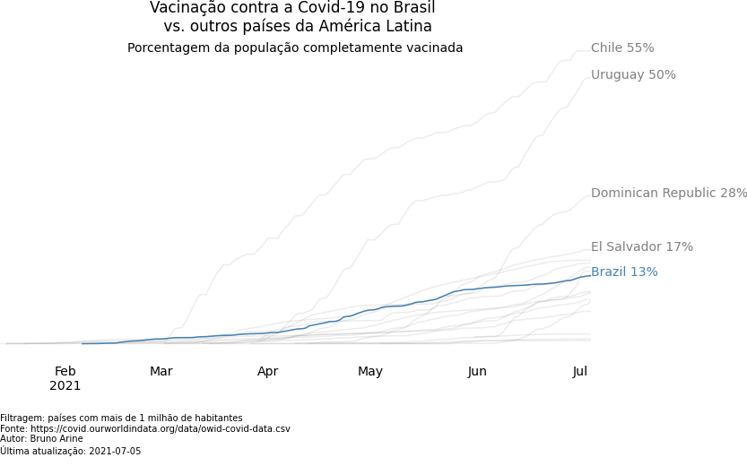

# Covid-19 vaccination in Brazil and the World

How is the Brazilian vaccination campaign faring against other countries? Not so well, according to the graph below.

But countries in Latin America have wildly different economic markers, and we know that vaccines cost money. It would be more sensible then to compare Brazil against countries with similar GDP per capita instead of geographical proximity.

